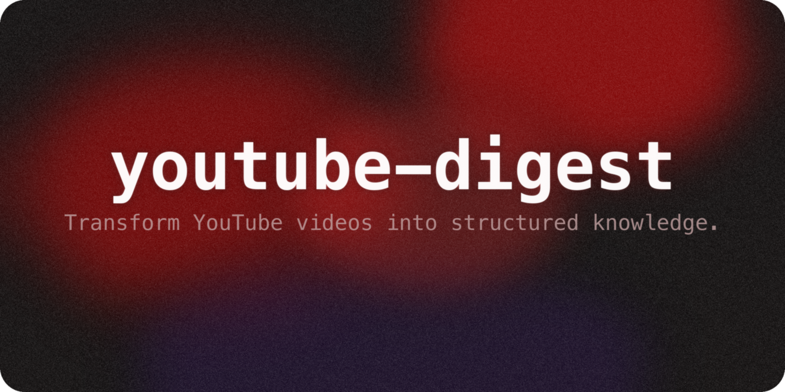

<p align="center"></p>

<h1 align="center">youtube-digest</h1>
<p align="center">
  <em>YouTube 영상을 구조화된 지식으로 변환 -- 핵심 요약, 주요 인사이트, 타임스탬프 주장, 그 이상까지.</em>
</p>
<p align="center">
  <a href="#빠른-시작">빠른 시작</a> · <a href="#기능">기능</a> · <a href="#사용법">사용법</a> · <a href="./README.md">English</a>
</p>
<p align="center">
  
  
  
  
</p>

---

[English](./README.md) | **한국어**

---

> [!NOTE]
> YouTube 자막을 추출하고, TL;DR, 핵심 요약, 타임스탬프 기반 주장, 토픽 타임라인, 주요 인용문이 포함된 구조화된 다이제스트를 생성하는 Claude Code 스킬입니다. 몇 시간짜리 영상을 몇 분 분량의 읽을거리로 변환합니다.

## 기능

- **즉시 TL;DR** -- 영상의 핵심 메시지를 1-2문장으로 요약
- **핵심 인사이트** -- 바로 활용 가능한 3-7개의 독립적 인사이트
- **타임스탬프 주장** -- 모든 주장을 원본 시점에 연결, `[인용 연구]`, `[의견]`, `[일화]` 태그 포함
- **토픽 타임라인** -- 타임스탬프, 주제, 한 줄 요약이 담긴 점프 테이블
- **주요 인용문** -- 발표자의 가장 인상적인 발언, 인용 가능한 형태
- **트리아지 모드** -- 2시간을 투자하기 전에 "볼 만한 가치가 있는가?" 빠른 판정
- **Obsidian 내보내기** -- 태그가 포함된 YAML 프런트매터, PKM 볼트에 바로 사용 가능
- **다중 영상 비교** -- 2-5개 영상을 나란히 비교: 공통점, 차이점, 고유 기여

## 빠른 시작

### Zip 업로드 (Claude 앱)

1. 이 저장소에서 [`youtube-digest.zip`](./youtube-digest.zip) 다운로드
2. **Claude 앱** → **설정** → **스킬** → **스킬 업로드** 열기
3. zip 파일 업로드
4. Python 의존성 설치: `pip install youtube-transcript-api`

### 복사-붙여넣기 설치

> [!TIP]
> 스킬을 지원하는 모든 LLM CLI(Claude Code, Codex, Gemini CLI)에서 작동합니다. 아래 블록을 채팅에 붙여넣기만 하세요.

```
youtube-digest 스킬을 설치해줘. 다음 단계를 수행해:
1. git clone https://github.com/wjgoarxiv/youtube-digest-skill.git /tmp/youtube-digest-skill
2. mkdir -p ~/.claude/skills/youtube-digest && cp -r /tmp/youtube-digest-skill/SKILL.md /tmp/youtube-digest-skill/scripts /tmp/youtube-digest-skill/assets ~/.claude/skills/youtube-digest/
3. pip install youtube-transcript-api
4. 테스트: python ~/.claude/skills/youtube-digest/scripts/fetch_transcript.py "https://youtu.be/dQw4w9WgXcQ" 2>/dev/null | python3 -c "import sys,json;d=json.load(sys.stdin);print(f'OK: {d[\"total_segments\"]} segments')"
5. "youtube-digest 스킬이 성공적으로 설치되었습니다"라고 말해
```

### 수동 설치

```bash
# 저장소 클론
git clone https://github.com/wjgoarxiv/youtube-digest-skill.git
cd youtube-digest-skill

# 스킬 디렉토리에 심볼릭 링크 생성
mkdir -p ~/.claude/skills
ln -s "$(pwd)" ~/.claude/skills/youtube-digest

# 의존성 설치
pip install youtube-transcript-api
pip install yt-dlp              # 선택사항: 더 풍부한 메타데이터
```

### 다른 도구

| 도구 | 스킬 경로 | 설치 명령 |
|------|-----------|-----------|
| **Claude Code** | `~/.claude/skills/youtube-digest/` | 위 참조 |
| **Codex CLI** | `~/.codex/skills/youtube-digest/` | `mkdir -p ~/.codex/skills && ln -s "$(pwd)" ~/.codex/skills/youtube-digest` |
| **Gemini CLI** | `~/.gemini/skills/youtube-digest/` | `mkdir -p ~/.gemini/skills && ln -s "$(pwd)" ~/.gemini/skills/youtube-digest` |

## 사용법

### 1. 기본 다이제스트

```
이 영상을 요약해줘: https://www.youtube.com/watch?v=VIDEO_ID
```

전체 구조화된 다이제스트를 생성합니다: TL;DR, 핵심 인사이트, 주요 주장, 토픽 타임라인, 주요 인용문, 전체 요약.

### 2. 트리아지 -- "볼 만한 가치가 있을까?"

```
3시간짜리 강의를 찾았는데, 배터리 기술에 관심 있는 사람이 볼 만한 가치가 있을까?
https://www.youtube.com/watch?v=VIDEO_ID
```

간결한 판정을 반환합니다: TL;DR + 필터링된 인사이트 + 시청/건너뛰기 추천.

### 3. Obsidian 내보내기

```
이 영상을 다이제스트하고 ~/vault/YouTube/에 있는 내 Obsidian 볼트에 저장해줘.
"machine-learning"과 "tutorial"로 태그해줘.
https://www.youtube.com/watch?v=VIDEO_ID
```

YAML 프런트매터(`title`, `channel`, `date`, `duration`, `url`, `tags`, `type: youtube-digest`)가 포함된 마크다운 파일을 출력합니다.

### 4. 다중 영상 비교

```
기후 정책에 대한 두 강연을 비교해줘:
https://www.youtube.com/watch?v=VIDEO_1
https://www.youtube.com/watch?v=VIDEO_2
```

각 영상의 개별 다이제스트와 함께, 공통점, 차이점, 고유 기여를 강조하는 비교 섹션을 제공합니다.

## 출력 형식

모든 다이제스트는 다음 구조를 따릅니다 (축약):

```markdown
# 영상 제목

**채널:** 이름 | **길이:** HH:MM:SS | **게시일:** 날짜
**URL:** 링크

---

## TL;DR
한두 문장의 요약.

## 핵심 인사이트
- 인사이트 1
- 인사이트 2
- ...

## 주요 주장 및 클레임
- 주장 내용 (3:42 시점) [인용 연구]
- 주장 내용 (12:15 시점) [의견]

## 토픽 타임라인
| 타임스탬프 | 주제      | 요약                   |
|-----------|-----------|------------------------|
| 0:00      | 도입부    | 문제를 설정...          |
| 3:42      | 핵심 논지 | ...을 주장              |

## 주요 인용문
> "정확한 인용문" -- 5:30 시점

## 전체 요약
3-5개 문단의 전체 서사.

---
*자막 기반으로 생성된 다이제스트입니다. 정확도는 자막 품질에 따라 달라집니다.*
```

> [!IMPORTANT]
> 섹션 순서는 의도적으로 설계되었습니다. 중간에 읽기를 멈춰도 최대 가치를 얻을 수 있도록 TL;DR이 가장 먼저, 전체 요약이 가장 마지막에 위치합니다.

## 작동 원리

```
                   youtube-digest 파이프라인
                   ~~~~~~~~~~~~~~~~~~~~~~~~

 [YouTube URL]
      |
      v
 +-------------------+
 | 1. 추출            |     fetch_transcript.py
 |   - 자막           |     youtube-transcript-api
 |   - 메타데이터     |     yt-dlp (선택사항)
 +-------------------+
      |
      v
 +-------------------+
 | 2. 분석            |     Claude LLM
 |   - 요약           |     자막 JSON의
 |   - 주장 추출      |     구조화된 분석
 |   - 타임라인 구성  |
 +-------------------+
      |
      v
 +-------------------+
 | 3. 포맷            |     마크다운 출력
 |   - digest.md      |     선택사항: Obsidian
 |   - 프런트매터     |     YAML 프런트매터
 +-------------------+
```

## 요구 사항

| 의존성 | 필수 여부 | 용도 |
|--------|----------|------|
| Python 3.8+ | 필수 | 런타임 |
| `youtube-transcript-api` | 필수 | 자막 추출 |
| `yt-dlp` | 아니오 (권장) | 풍부한 메타데이터 (제목, 채널, 길이, 챕터) |
| `markitdown[youtube-transcription]` | 아니오 (대체) | 기본 방법 실패 시 백업 자막 소스 |

> [!WARNING]
> `yt-dlp`가 없으면 메타데이터(제목, 채널, 길이)를 사용할 수 없습니다. 다이제스트는 여전히 작동하지만, 헤더가 불완전합니다. `pip install yt-dlp`로 설치하세요.

## 기여하기

기여를 환영합니다! 다음 절차를 따라주세요:

1. 저장소를 포크합니다
2. 기능 브랜치를 생성합니다 (`git checkout -b feature/my-feature`)
3. 변경사항을 커밋합니다
4. Pull Request를 생성합니다

버그 리포트나 기능 요청은 [이슈를 생성](https://github.com/wjgoarxiv/youtube-digest-skill/issues)해주세요.

## 라이선스

이 프로젝트는 [MIT 라이선스](./LICENSE)에 따라 라이선스가 부여됩니다.
